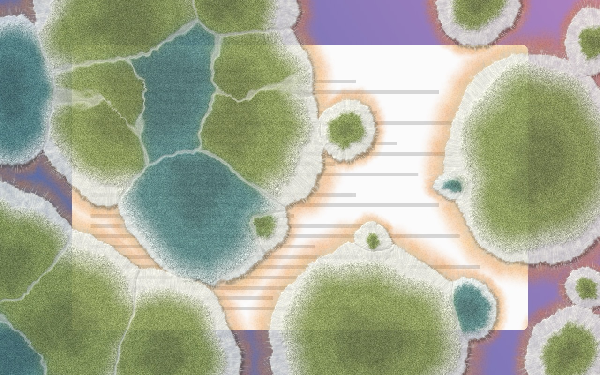
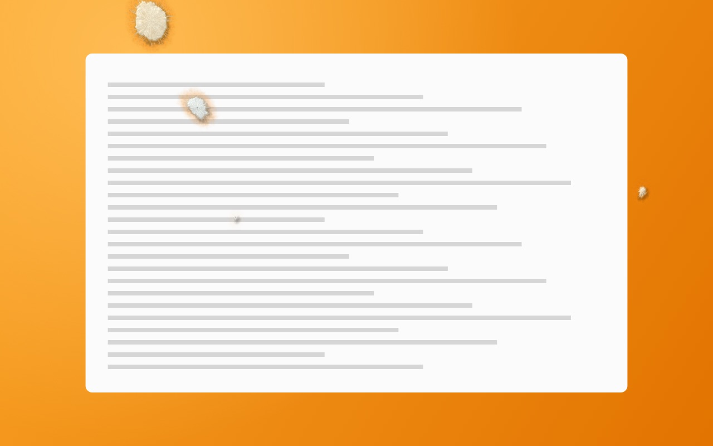
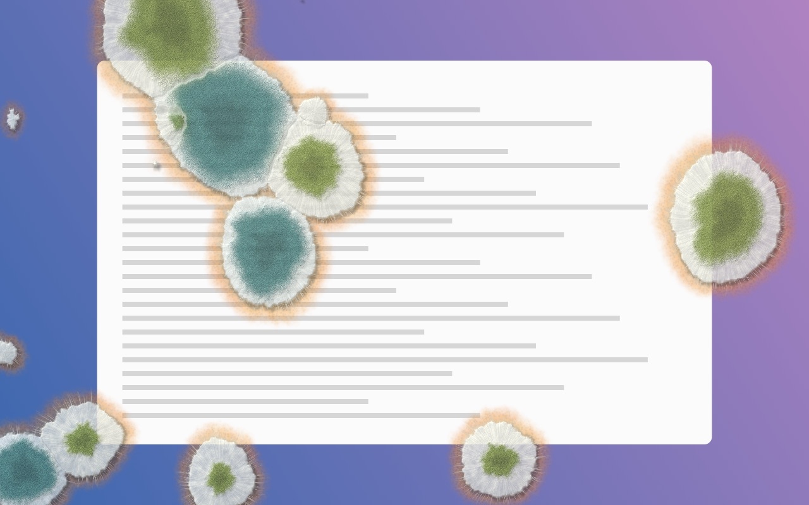
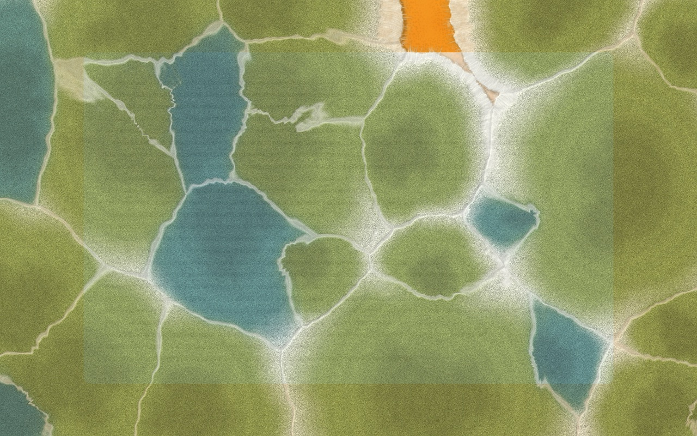
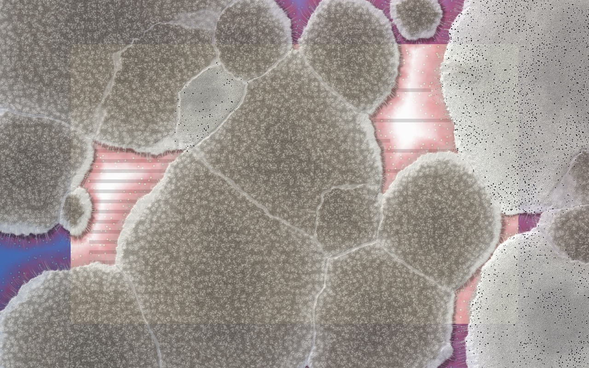
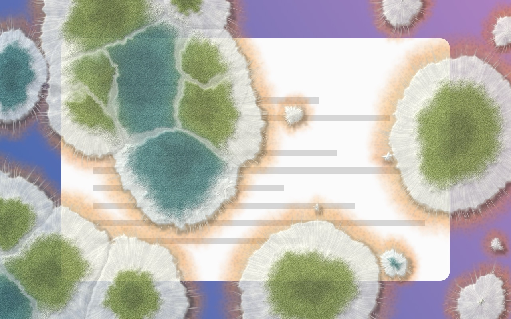
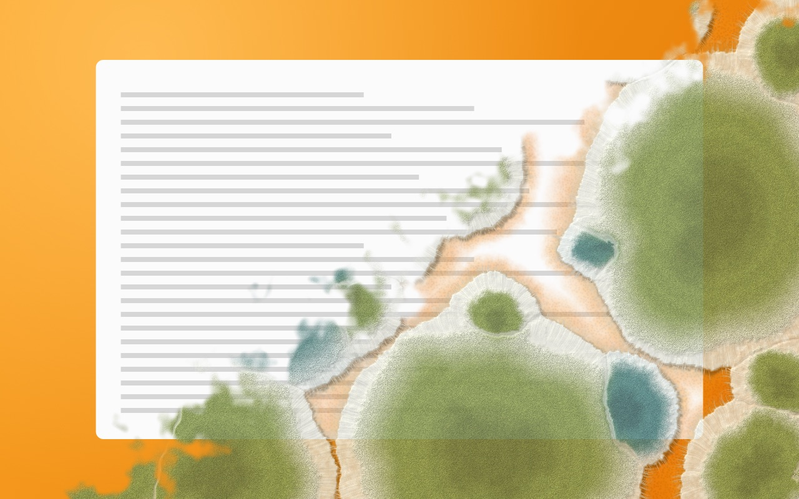

# Mould

**A macOS menu bar app that slowly grows mould over your screen.** A warning that you've been behind the screen too long, and also just gross.



After a couple of minutes a lonely white speck lands near the edge of your screen. At ten minutes a few fuzzy dots appear. At half an hour there are olive-green and blue-green colonies ringed by white fluff, with brown water-soaked rot around their edges. After an hour it has claimed most of the screen, and you should stand up.

Press **⌃⌥⌘M** to wipe it off. Locking the screen, starting the screensaver, sleeping the Mac or switching user also starts it over, because that means you stepped away.

| 10 min | 25 min | 60 min |
|---|---|---|
|  |  |  |

| Strawberry: grey mould and pin mould | Close-up | Wiping it off |
|---|---|---|
|  |  |  |

## The fungi

Every colony is one of four real fruit moulds, each drawn the way it grows:

- ***Penicillium digitatum***, green mould of citrus: an olive-green powdery spore mass with a wide band of white mycelium around it.
- ***Penicillium italicum***, blue mould of citrus: blue-green spores with a narrow white margin.
- ***Botrytis cinerea***, grey mould of strawberries: a dense grey-brown velvet with grape-like conidia clumps.
- ***Rhizopus stolonifer***, pin mould: loose white cotton covered in sporangia that ripen from white to grey to black.

Pick the fruit from the menu bar: **Forgotten orange** (both Penicillia), **Punnet of strawberries** (Botrytis and Rhizopus), or **Compost bin** (everything).

## Install

Needs macOS 14 or later and the Swift toolchain (Xcode or the Command Line Tools).

```sh
make install      # builds build/Mould.app (universal) and installs it
open ~/Applications/Mould.app
```

`make install` puts the app in `~/Applications` if that folder exists, and otherwise in `/Applications`. Pick another folder with `make install DEST=/some/folder`.

### Signing and notarization

`make app` signs with the first **Developer ID Application** certificate in your keychain, using the hardened runtime and a secure timestamp. Without one it falls back to ad-hoc signing. Choose a certificate with `SIGN_IDENTITY="Developer ID Application: …" make app`, or force ad-hoc with `SIGN_IDENTITY=- make app`.

To ship it to other Macs without Gatekeeper warnings, notarize it. First store your notary credentials in the keychain once, using an [app-specific password](https://account.apple.com):

```sh
xcrun notarytool store-credentials mould-notary --apple-id you@example.com --team-id HFFHH9CJYF
make release      # sign, notarize, staple, and zip → build/Mould.zip
```

To use a differently named keychain profile, run `NOTARY_PROFILE=name make release`.

Mould is a menu bar app (the petri dish icon) with no Dock icon. The menu has:

- **Wipe It Off** (⌃⌥⌘M)
- **Fruit**: which moulds grow
- **Thickness**: how opaque the mould gets (faint, hearty or fully furry)
- **Growth Speed**: one hour, ten minutes, or a one-minute demo
- **Pause While I'm Away**: growth stops after 5 minutes without keyboard or mouse input
- **Hide During Screenshots** (on by default): when you press Space in ⌘⇧4 to pick a window, the mould turns invisible so the picker sees the window instead of the mould-covered screen, and it returns 4 seconds after the capture. ⌘⇧3 and ⌘⇧4 region screenshots keep the mould on them.
- **Open at Login**

The hotkey uses Carbon's `RegisterEventHotKey`, so it doesn't need Accessibility permission. The overlay ignores the mouse, so you can keep working through the mould, if you can stand it.

## Development

Everything runs from the command line. There is no Xcode project.

```sh
make test         # swift test: simulation, clock, options, and the real shader on the GPU
make run          # build the .app and open it
make demo         # the whole hour in one minute
make snapshots    # regenerate docs/*.jpg
```

Snapshot mode renders offscreen to a PNG without starting the overlay:

```sh
swift run Mould --snapshot out.png --at 45 --theme strawberry --size 1512x982 --scale 2 --seed 7
swift run Mould --snapshot out.png --at 30 --background my-screenshot.png
swift run Mould --minutes 40 --speed 60          # start the live overlay 40 minutes in, at 60× speed
```

### How it works

- **`MouldCore`** is plain Swift with no UI. `MouldSimulation` is a pure function of *(seed, screen size, elapsed time)*. It plants about 26 colonies with accelerating birth times: first at the damp screen edges, then as satellites of existing colonies, then wherever there's room. Each colony germinates slowly, then grows radially at a speed tied to its species and the screen diagonal, so the same hour tells the same story on any display. A spore that lands on ground another colony already claimed stays dormant. `GrowthClock` only counts time you actually spend at the screen.
- **`MouldRender`** is a single full-screen Metal fragment shader, with its source embedded in Swift and compiled at runtime. It draws, per colony:
  - a domain-warped, lobed outline, with the angular profile precomputed into a lookup texture
  - hyphae that wander outwards past the edge
  - a powdery spore mass with sporulation rings and a pale young front
  - pale seams where two colonies' growth fronts meet
  - a glossy water-soaked rot zone, and beyond it a halo of fruit peel (orange oil-gland dimples, or red strawberry flesh with yellow seeds)
  - a contact shadow, and micro-bump lighting from the top-left

  It costs roughly 10–45 ms of GPU time per frame at 3024×1964 on an M2. At real-time speed it only redraws every 2 seconds, since mould moves by less than a pixel in that time.
- **`MouldApp`** does the AppKit side:
  - one borderless, click-through window per screen, one level below the screensaver window level, on all Spaces and over full-screen apps
  - the Carbon hotkey
  - a screenshot guard. macOS's window picker grabs the topmost non-transparent pixel under the pointer, whatever the window's level or sharing type, and decides shortly after Space is pressed. Keystrokes can't be seen without Input Monitoring, but the system cursor (`NSCursor.currentSystem`) gives the mode away: ⌘⇧4 turns it into a crosshair and Space into a camera. So the overlays go fully transparent while a `screencaptureui` window is on screen (recognised by its executable path, because its name is localised) and the pointer has changed from that crosshair, and return 4 seconds after the capturing click. ⌘⇧3 leaves the pointer alone, so its floating thumbnail, which comes with an identical window, doesn't count. The window list is only checked while ⌘⇧ are held and for a second after, since every screenshot shortcut starts with them (the modifier state can be read without any permission).
  - listeners for `com.apple.screenIsLocked`, `com.apple.screensaver.didstart`, display sleep, system sleep and session switches

## The web version

The original generative-art sketch is in [`web/index.html`](web/index.html). It's a pointillist orange slowly taken over by mould, inspired by [Kathleen Ryan's mouldy-fruit sculptures](https://www.thisiscolossal.com/2019/10/kathleen-ryan-moldy-fruit/). Open it in a browser and click to plant spores.

Vincent Bruijn 2025–2026
